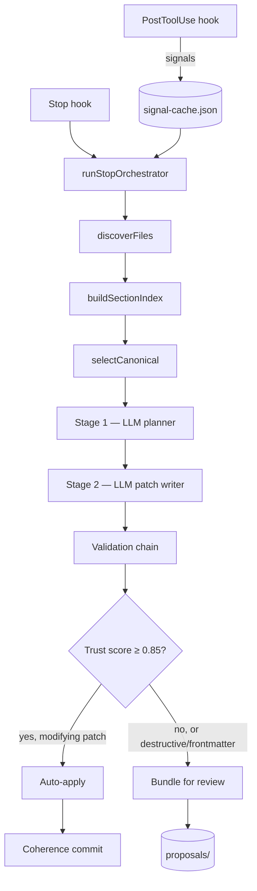

# Coherence — architecture

> Hand-curated narrative + Mermaid diagrams of the Stop-pipeline data flow.
> Complements the auto-generated graph in `graphify-out/` (gitignored;
> regenerate locally with `/graphify --update`), which is a
> community-detection network graph, not a teaching diagram.

## The 30-second model

Coherence runs as a Claude Code plugin. Three things happen, in order:

1. **Signal capture (PostToolUse hook).** As you edit code, lightweight
   detectors notice when an anchored documentation section is likely stale.
2. **Stop pipeline (Stop hook).** When the model finishes responding,
   coherence picks up the staged signals, runs a two-stage LLM pipeline to
   plan and write patches, validates each patch through eight assertion
   engines + a hallucination check, and either auto-applies (if the
   section's trust score is high enough) or bundles for human review.
3. **Out-of-band review (slash commands).** Whenever you want, you call
   `/coherence:status` to see what's pending, `/coherence:review` to run
   the pipeline mid-session, `/coherence:propose accept` / `reject` to act
   on bundled proposals.

## Pipeline diagram

## Validation chain (zoomed in)

```mermaid
flowchart LR
  patch[Stage 2 patch] --> format[format check]
  format --> apply[apply to working tree]
  apply --> sanity[sanity check]
  sanity --> lineRatio[line-ratio check]
  lineRatio --> injection[prompt-injection scan]
  injection --> hallucination[hallucination grep]
  hallucination --> asserts[asserts engines &times; 8]
  asserts --> ok[OK -> trust gate]
```

Eight asserts engines run after hallucination: five **text-pattern** (sync)
— `has_example`, `no_placeholder_links`, `max_words`, `min_words`,
`no_todo_comments` — and three **codebase-linked** (async, with a
per-session file-list cache by language) — `symbol_exists`, `file_exists`,
`symbol_exported`. Each carries `policy: block | warn` (default `warn`),
with a 10-assertion cap per section. The integration point is
[src/pipeline/stage2.ts](../src/pipeline/stage2.ts).

## File-only architecture (DD-117)

Coherence is a file-only plugin. There is no project-side server, database,
or hosted upload service. All state lives on disk:

- Per-developer state under `.claude/coherence/` (gitignored).
- Team-distributable surfaces under `coherence/` (committed; the substrate
  for cross-team plans, the ignore split, and the team trust aggregate).

The full state-file inventory + JSON shapes lives in
[state-files.md](state-files.md). Failure modes per file —
healthy / quarantined / locked / missing — live in
[failure-modes.md](failure-modes.md).

Cross-team plans, instead of needing a backend, live as committed JSON at
`coherence/plans/<branch-sha-12>/<plan-id>.json`. Telemetry is a local
JSONL file + a user-driven `curl` for the opt-in export. The architecture
gate `M-ARCH-1` (in `tests/static-analysis/no-network.test.ts`)
statically asserts no production module imports a network API or embeds a
non-Anthropic HTTPS URL.

The companion invariant is **no legacy version support (DD-118)**: each
major version stands alone. Cross-major upgrades are refused at
SessionStart (`refuseLegacy()` in `src/state/refuseLegacy.ts`). No
migrator chain, no `prompts/v1/` retained in the tarball.

## State directories

| Path | Owner | Committed? | Contents |
| ---- | ----- | ---------- | -------- |
| `.claude/coherence/` | per-developer | gitignored | runtime state, locks, sentinels, trust ledger, signal cache, proposals quarantine, metrics |
| `.claude/coherence/proposals/<kind>/<id>/` | per-developer | gitignored | DD-065 quarantine for net-new artifacts (`skill` / `agent` / `slash_command` / `annotate`) |
| `.claude/coherence/quarantine/` | per-developer | gitignored | files that failed schema validation; bytes preserved for inspection |
| `coherence/ignore` | team | committed | newline-delimited path globs, additively merged at scan time |
| `coherence/ignore.local` | per-developer | gitignored | personal globs that compose with the team file |
| `coherence/plans/<branch-sha-12>/<plan-id>.json` | team | committed | cross-team plan artifacts (DD-099 amended) |
| `coherence/trust/<author-hash>.json` | team | committed | per-developer trust aggregates produced by `/coherence:trust sync` |

Resolution helpers live in [src/state/init.ts](../src/state/init.ts):
`getCoherenceDir()` derives the per-developer root; `makeStateStore()`
constructs the atomic-write `StateStore` instance everything else uses.

## God nodes (start here when reading source)

| Symbol | File | Role |
| ------ | ---- | ---- |
| `runStopOrchestrator()` | [src/pipeline/stop.ts](../src/pipeline/stop.ts) | Central coordinator. Gates auto-apply on `getSectionScore()` for `modifying` patches and emits synthetic accept events for auto-applied patches. |
| `processSection()` | [src/pipeline/stage1.ts](../src/pipeline/stage1.ts) | Per-section planner call. |
| `nowIsoUtc()` | [src/util/time.ts](../src/util/time.ts) | Timestamps everything; appears in many communities of the graph. |
| `withExceptionGuard()` | [src/hooks/exceptionGuard.ts](../src/hooks/exceptionGuard.ts) | Wraps every hook handler. On the 3rd exception in a session, writes the `auto-disabled` sentinel and silently early-returns. |
| `getCoherenceDir()` | [src/state/init.ts](../src/state/init.ts) | All state paths derive from this. |
| `parse()` | [src/llm/cassette.ts](../src/llm/cassette.ts) | LLM cassette parsing; the record/replay bridge for tests. |
| `assembleBundle()` | [src/pipeline/bundle.ts](../src/pipeline/bundle.ts) | Packages sections for review. |
| `selectCanonical()` | [src/pipeline/canonical.ts](../src/pipeline/canonical.ts) | Picks which section is canonical when duplicates exist. |
| `recordEvent()` | [src/state/trustLedger.ts](../src/state/trustLedger.ts) | Records accept/edit/revert against a sectionRef; serialised by in-process `withLedgerLock`. |
| `getSectionScore()` | [src/state/trustLedger.ts](../src/state/trustLedger.ts) | DD-138 score lookup with lazy stale-recompute; called by the stop pipeline auto-apply gate. |
| `applyAssertions()` | [src/validation/assertions/applyToPatch.ts](../src/validation/assertions/applyToPatch.ts) | Reads file frontmatter `asserts:` and routes each entry to the registry; called from `stage2.ts` after the hallucination check. |
| `runAutoAcceptSweep()` | [src/proposals/autoAcceptSweep.ts](../src/proposals/autoAcceptSweep.ts) | FR-TRUST-3 net-new auto-accept; SessionStart-only. |
| `handleDeepAudit()` | [src/audit/deepConsistency.ts](../src/audit/deepConsistency.ts) | Two-step flag-based cost gate for the LLM cross-section consistency pass. |

## Where to go next

- [Extension tutorials](extensions/) — add an asserts engine, a language to
  hallucination detection, or a hook event handler.
- [Failure modes](failure-modes.md) — what each state file looks like when
  broken, and how to recover.
- [Comparison](comparison.md) — Coherence vs vale / lychee / docs-as-tests.
- [ADR register](adr/) — accepted design decisions (DD-001..DD-147).
- [User guide](user-guide.md) — narrative walkthrough.
- [State-file inventory](state-files.md) — every JSON file, every schema.
