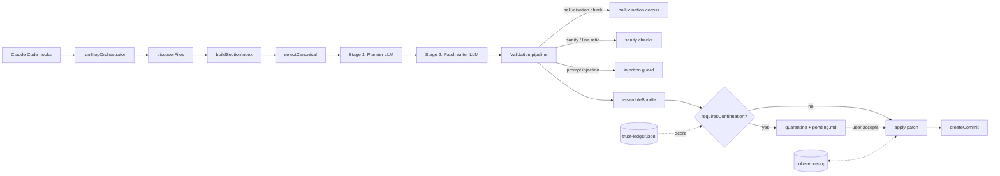

<!-- url: https://www.notion.so/35f010d46a7081feb7e7e2ab737e96d5 -->
<!-- id: 35f010d4-6a70-81fe-b7e7-e2ab737e96d5 -->
<!-- title: 🏛 Architecture -->
## System overview
Coherence sits between Claude Code and the project's documentation. When a session ends or a tool call lands a change, hooks fire the stop orchestrator. The orchestrator discovers affected sections, picks the canonical one per group, runs a two-stage LLM pipeline (planner then patch writer), validates the patches, and either auto-applies or quarantines them based on patch kind and per-section trust score. All state is file-based and version-controlled where appropriate.
## Pipeline diagram
Below is the Mermaid source for the pipeline. The block was created as a code block with Mermaid language; if it renders as text, change the block language to mermaid in Notion.

## Components
- Hooks layer — Claude Code event listeners (PostToolUse, Stop, SessionStart). All hook handlers wrap with withExceptionGuard so a single failure cannot block the session.
- Detection — section indexing, file discovery, anchor scanning, compaction detection.
- Pipeline — runStopOrchestrator coordinates Stage 1 (planner) and Stage 2 (patch writer). The two stages must never be collapsed into one call.
- Validation — hallucination corpus check, sanity / line-ratio gates, prompt-injection guard. Language-specific symbol registries live in src/validation/registries.
- State — atomic write pattern via stateStore, quarantine for corrupt files, sentinels as kill-switches, migrations under src/state/migrate.
- Cassette system — every LLM call is recorded and replayed deterministically in tests; never bypass it.
- Trust ladder (v1.0) — per-section accept/edit/revert scoring with a 30-day half-life. Modifying patches auto-apply once score \>= 0.85; destructive and frontmatter patches always defer to user confirmation.
- Degraded mode — when exception rate breaches threshold, Coherence backs off silently instead of blocking the session. Check isDegraded() before adding new hook logic.
## Design commitments
- DD-117 — File-only architecture; no backend service. All state lives under .claude/coherence/ or coherence/.
- DD-118 — Cross-major migration retired at v1.0; re-install preserves state, fresh install initialises empty trust-ledger.
- DD-128 — All --out flags use a shared sandbox helper that prevents writes outside the project tree unless --allow-out-of-tree is set.
- DD-138 — Trust score formula uses a 30-day half-life (alpha = 0.977) with accept = +1/+1, revert = -1/+1, edit = 0/+0.5 weights.
## Data flow for a new feature
- 1. A hook fires (postToolUse or stop).
- 2. runStopOrchestrator in src/pipeline/stop.ts coordinates.
- 3. discoverFiles, then buildSectionIndex, produce candidate sections.
- 4. selectCanonical picks the canonical section per group.
- 5. runStage1 plans patches per section via the planner LLM.
- 6. runStage2 writes diffs via the patch-writer LLM.
- 7. Validation pipeline runs: hallucination check, sanity, line ratio, injection guard.
- 8. assembleBundle packages patches; requiresConfirmation decides apply vs quarantine.
- 9. createCommit via the git adapter; coherence log records the outcome.
